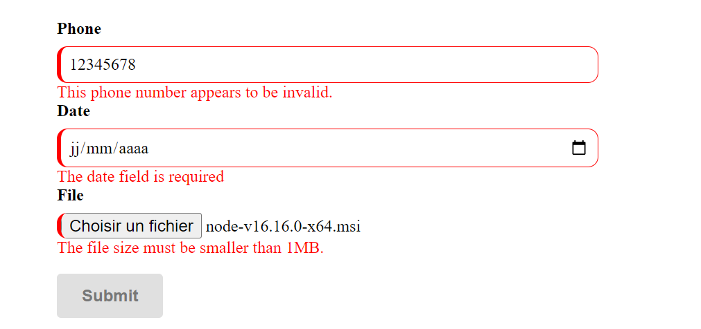

 
# Getting Started

`Quickv` *(pronounced as 'cue-v' in French)* is a lightweight and easy-to-use JavaScript library for client-side validation of HTML forms. With Quickv, you can quickly and easily add validation rules to your form fields using custom HTML attributes, without needing a lot of extra JavaScript code. Quickv's custom HTML attributes are simple to understand and use, allowing developers to set up a robust validation system quickly without devoting a lot of time to creating custom validation functions or writing complex JavaScript code. If you're looking for a simple and effective solution for client-side validation of your HTML forms, Quickv may be the ideal tool for you.
 
##  Why use Quickv?

The goal of Quickv is to simplify the validation process and save time for developers, allowing them to focus on other aspects of application development. By providing a fast and easy-to-use validation solution, **Quickv** can be an attractive choice for developers looking for an effective solution to add client-side validation to their HTML forms without sacrificing a lot of time in the process.

## Example
```html
 <form id="myForm" > 
      <div>
        <label class="label">Phone</label>
        <input type="text" data-qv-rules="required|phone:US" name="phone" />
        <div data-qv-feedback="phone"></div>
      </div>
      <div>
        <label class="label">Date</label>
        <input
          type="date"
          data-qv-rules="required|date|after:now"
          name="date"
        />
        <div data-qv-feedback="date"></div>
      </div>
      <div>
        <label class="label">File</label>
        <input
          type="file"
          data-qv-rules="required|file|maxFileSize:1MB"
          name="file"
        />
        <div data-qv-feedback="file"></div>
      </div>
      <p><button type="submit" data-qv-submit>Submit</button></p>
  </form>
```
Screenshot
